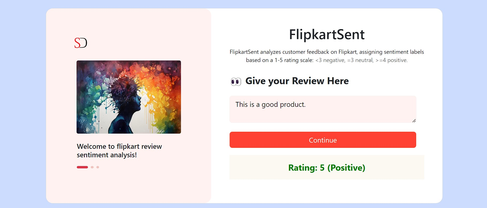

# Sentiment Analysis of Flipkart Reviews

This project aims to perform sentiment analysis on Flipkart reviews using machine learning techniques. The project involves several stages including data ingestion, data validation, data transformation, model training, model evaluation, and deployment. Additionally, it integrates MLflow for experiment tracking, DVC for version control, DAGsHub for collaborative development, and AWS EC2 for hosting with CI/CD pipeline setup.

A live demo of the project is available [here](https://sentiment-analysis-of-flipkart-reviews.onrender.com/).

## Pipeline Stages:

### 1. Data Ingestion Stage:
- Raw data is collected from Flipkart reviews dataset. This data could be stored locally or fetched from an external source.

### 2. Data Validation:
- Data validation stage ensures the integrity and quality of the dataset. It includes checking for missing values, outliers, and other inconsistencies.

### 3. Data Transformation:
- In this stage, the raw data is preprocessed and transformed into a format suitable for model training. This may involve text preprocessing, feature extraction, and encoding.

### 4. Model Training:
- Machine learning models are trained on the preprocessed data to predict the sentiment of reviews. Various algorithms such as Naive Bayes, Support Vector Machines, or Neural Networks can be employed.

### 5. Model Evaluation:
- The trained models are evaluated using appropriate evaluation metrics such as accuracy, precision, recall, and F1-score to assess their performance.

## Tools and Practices:

### - MLflow Tracking:
- MLflow is used to track experiments, parameters, and metrics during the model development process. It helps in comparing different models and reproducing results.

### - DVC (Data Version Control):
- DVC is utilized for versioning and managing large datasets. It enables reproducibility by tracking changes to data files and facilitating collaboration among team members.

### - DAGsHub:
- DAGsHub provides a platform for collaborative development and version control of machine learning projects. It integrates with Git and DVC to streamline the development process.

### - AWS EC2 Hosting with CI/CD:
- The trained model is deployed on AWS EC2 for inference. A CI/CD pipeline is set up to automate the deployment process. Changes to the codebase trigger automatic testing and deployment to ensure continuous integration and delivery.

## Getting Started:

To get started with the project, follow these steps:

1. Clone the repository

2. Install dependencies:

3. Set up AWS EC2 instance for hosting.

4. Configure CI/CD pipeline for automated deployment.

5. Start experimenting with different models and hyperparameters.

## Contributors:

- Subhayu Dutta

## License:

This project is licensed under the GNU License - see the [LICENSE](LICENSE) file for details.

